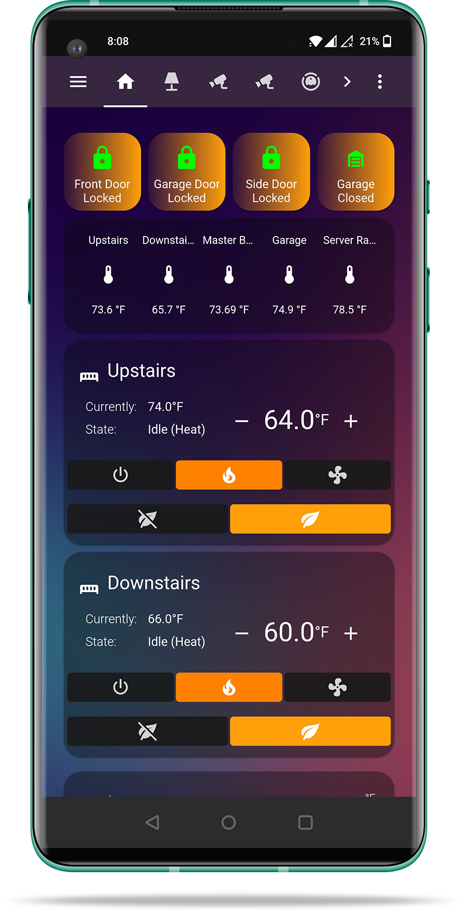
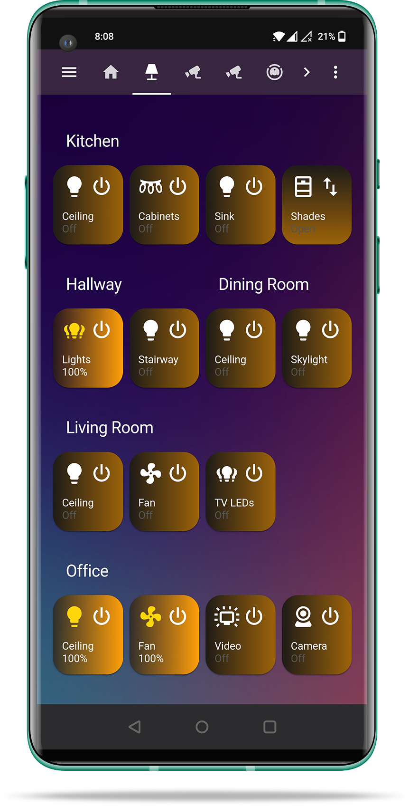
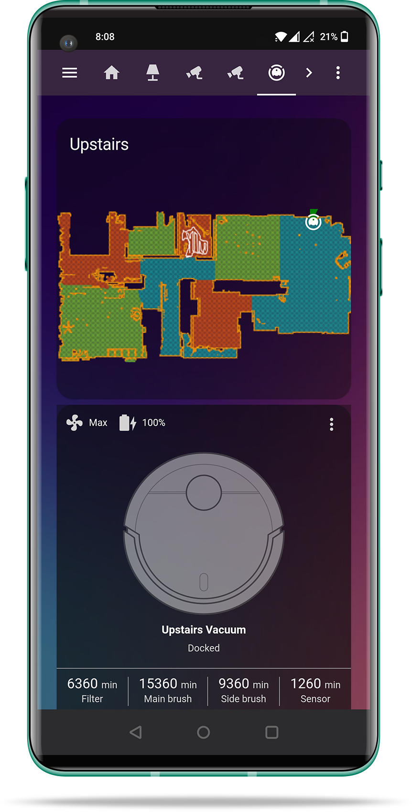
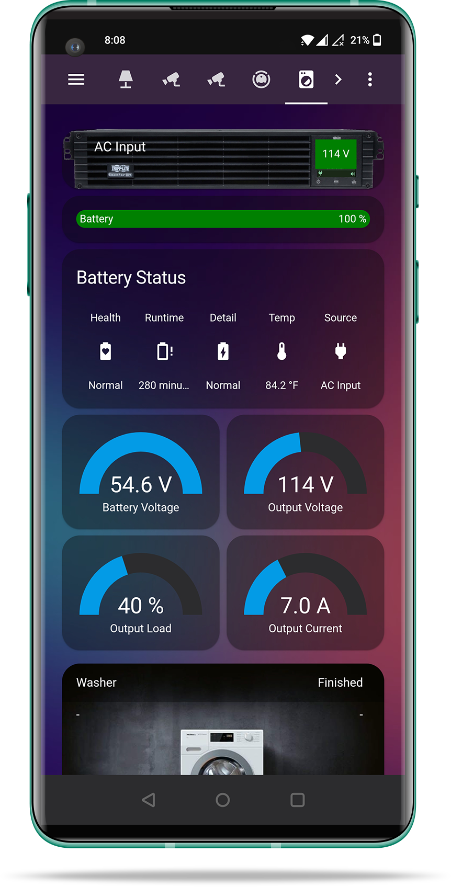
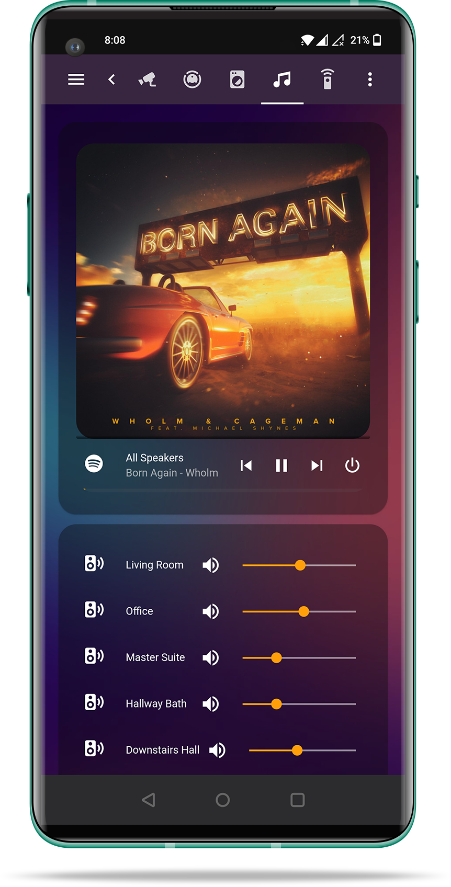
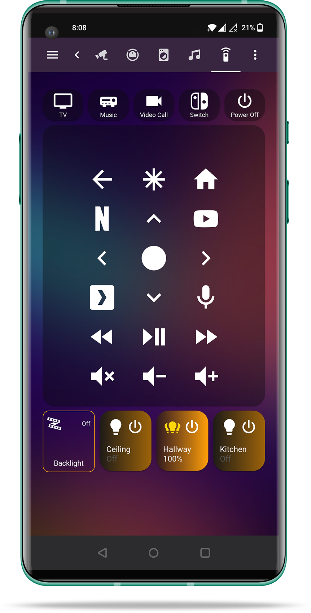

# Home Assistant Configuration
![Project Maintenance][maintenance-shield]
[![License][license-shield]](LICENSE.md)
[![GitHub Actions][actions-shield]][actions]
[![GitHub Activity][commits-shield]][commits]
[![GitHub Last Commit][last-commit-shield]][commits]
![CodeRabbit Pull Request Reviews][coderabbit-shield]

## About

My comprehensive Home Assistant configuration for a smart home with extensive automation, security monitoring, and entertainment systems. The setup focuses on reliability, user experience, and integration across multiple protocols (Z-Wave, Zigbee, IP, Bluetooth). This configuration serves as a showcase of advanced Home Assistant capabilities and custom automation solutions.

## Architecture Overview

**Hardware Infrastructure:**
- Lenovo Tiny P330 Cluster running Home Assistant (Container) in a VM (4 CPU cores, 4GB RAM, 50GB disk)
- Multiple tablets and mobile devices for interface access
- Distributed radio connectivity via IP network

**Software Stack:**
- [Home Assistant](https://home-assistant.io) with package-based configuration
- [ZWaveJS2MQTT](https://zwave-js.github.io/zwavejs2mqtt/) for Z-Wave device management
- [Zigbee2MQTT](https://www.zigbee2mqtt.io/) for Zigbee device management
- [Valetudo](https://valetudo.cloud/) for robot vacuums
- [Mosquitto](https://mosquitto.org/) MQTT broker for device communication
- Custom integrations for specialized functionality

**Network Topology:**
- Centralized server-based architecture
- Distributed radio connectivity via IP network
- Multi-protocol support (Z-Wave, Zigbee, IP, Bluetooth)
- Centralized authentication with LDAP integration

## Custom Integrations

### Security & Monitoring
- **[alarmo](https://github.com/nielsfaber/alarmo)**: Advanced alarm system with multiple zones and automation triggers
- **[frigate](https://github.com/blakeblackshear/frigate)**: AI-powered video surveillance with object detection
- **[noonlight](https://github.com/konnected-io/noonlight-hass)**: Emergency response integration for enhanced security

### Climate & Environment
- **[adaptive_lighting](https://github.com/basnijholt/adaptive-lighting)**: Automatic lighting adjustments based on time and natural light
- **[battery_notes](https://github.com/andrew-codechicken/battery-notes)**: Battery level tracking with smart notifications
- **[enphase_envoy](https://github.com/briancmpbll/home_assistant_custom_envoy)**: Solar panel monitoring and energy production tracking

### Media & Entertainment
- **[huesyncbox](https://github.com/mvdwetering/huesyncbox)**: Philips Hue Sync Box control for TV lighting synchronization
- **[spotcast](https://github.com/fondberg/spotcast)**: Spotify casting integration for whole-home audio
- **[vaddio_conferenceshot](https://github.com/rohankapoorcom/vaddio_conferenceshot)**: Professional video conferencing camera control
- **[webrtc](https://github.com/AlexxIT/WebRTC)**: WebRTC camera integration for real-time video streaming

### Smart Home Control
- **[ecoflow](https://github.com/lwsrbrts/hassio-ecoflow)**: Portable power station monitoring and control
- **[ecoflow_cloud](https://github.com/tolwi/hassio-ecoflow-cloud)**: Cloud-based EcoFlow device management
- **[keymaster](https://github.com/FutureTense/keymaster)**: Advanced lock management with access codes and scheduling
- **[smartir](https://github.com/smartHomeHub/SmartIR)**: Infrared remote control for legacy devices

### Utilities & Tools
- **[browser_mod](https://github.com/thomasloven/hass-browser_mod)**: Browser-based automations and popups
- **[lovelace_gen](https://github.com/thomasloven/hass-lovelace_gen)**: Dynamic Lovelace dashboard generation
- **[mass_queue](https://github.com/droans/mass_queue)**: Mass (Music Assistant) queue management
- **[midas](https://github.com/MattDahEpic/ha-midas)**: California energy prices from MIDAS API
- **[mqtt_discoverystream](https://github.com/koying/mqtt_discoverystream_ha)**: MQTT device discovery and management
- **[mqtt_vacuum_camera](https://github.com/sca075/mqtt_vacuum_camera)**: Robot vacuum camera integration
- **[open_epaper_link](https://github.com/OpenEPaperLink/Home_Assistant_Integration)**: E-paper display integration
- **[pirateweather](https://github.com/alexander0042/pirate-weather-hass)**: Alternative weather data provider
- **[qr_generator](https://github.com/DeerMaximum/QR-Code-Generator)**: QR code generation for device setup
- **[remote_homeassistant](https://github.com/AlexxIT/RemoteHomeAssistant)**: Remote Home Assistant integration
- **[simpleicons](https://github.com/vigonotion/hass-simpleicons)**: Custom icon integration for enhanced UI
- **[smartthinq_sensors](https://github.com/ollo69/ha-smartthinq-sensors)**: LG ThinQ sensor integration
- **[spook](https://spook.boo/)**: Enhanced entity management and automation
- **[spook_inverse](https://spook.boo/)**: Inverse entity management for advanced automation

## Custom Lovelace Cards

### Data Visualization
- **[apexcharts-card](https://github.com/RomRider/apexcharts-card)**: Advanced charting and graphs for sensor data
- **[bar-card](https://github.com/custom-cards/bar-card)**: Bar chart visualizations for comparative data
- **[power-flow-card](https://github.com/ulic75/power-flow-card)**: Energy flow visualization for solar systems
- **[weather-card](https://github.com/bramkragten/weather-card)**: Comprehensive weather display and forecasting

### Home Automation
- **[button-card](https://github.com/custom-cards/button-card)**: Customizable button interface for device control
- **[numberbox-card](https://github.com/junkfix/numberbox-card)**: Numeric input controls for devices
- **[simple-thermostat](https://github.com/nickdos/simple-thermostat)**: Thermostat interface with scheduling
- **[slider-button-card](https://github.com/mattieha/slider-button-card)**: Slider controls with button actions

### Layout & Navigation
- **[hass-swipe-navigation](https://github.com/zanna-37/hass-swipe-navigation)**: Swipe-based navigation for mobile interfaces
- **[kiosk-mode](https://github.com/NemesisRE/kiosk-mode)**: Kiosk interface mode for wall-mounted tablets
- **[lovelace-layout-card](https://github.com/thomasloven/lovelace-layout-card)**: Advanced layout management with conditional displays
- **[stack-in-card](https://github.com/custom-cards/stack-in-card)**: Nested card layouts for complex interfaces
- **[vertical-stack-in-card](https://github.com/ofekashery/vertical-stack-in-card)**: Vertical stacking for organized layouts

### Media & Entertainment
- **[advanced-camera-card](https://github.com/dermotduffy/advanced-camera-card)**: Comprehensive camera card with live viewing, clips browsing, and fullscreen mode
- **[lovelace-xiaomi-vacuum-map-card](https://github.com/PiotrMachowski/lovelace-xiaomi-vacuum-map-card)**: Robot vacuum mapping interface
- **[mass-player-card](https://github.com/abmantis/mass-player-card)**: Mass (Music Assistant) player controls and interface
- **[mass_card](https://github.com/abmantis/mass_card)**: Mass (Music Assistant) card for music streaming
- **[mini-media-player](https://github.com/kalkih/mini-media-player)**: Compact media controls for audio/video
- **[mixer-card](https://github.com/wrodie/mixer-card)**: Audio mixer controls with faders and sliders for audio devices
- **[roku-card](https://github.com/custom-cards/roku-card)**: Roku device control and status

### Utilities
- **[config-template-card](https://github.com/iantrich/config-template-card)**: Template-based card configuration
- **[custom-brand-icons](https://github.com/elax46/custom-brand-icons)**: Custom brand icons for enhanced UI
- **[decluttering-card](https://github.com/custom-cards/decluttering-card)**: UI simplification and conditional displays
- **[lovelace-auto-entities](https://github.com/thomasloven/lovelace-auto-entities)**: Dynamic entity lists based on device states
- **[lovelace-card-mod](https://github.com/thomasloven/lovelace-card-mod)**: CSS styling and modifications for custom appearance
- **[lovelace-digital-clock](https://github.com/wassy92x/lovelace-digital-clock)**: Digital clock display
- **[lovelace-fold-entity-row](https://github.com/thomasloven/lovelace-fold-entity-row)**: Collapsible entity rows
- **[lovelace-state-switch](https://github.com/thomasloven/lovelace-state-switch)**: State-based card switching
- **[lovelace-template-entity-row](https://github.com/thomasloven/lovelace-template-entity-row)**: Template-based entity rows

## Custom Blueprints
This configuration includes a comprehensive collection of custom blueprints created by the repository owner for various automation scenarios.

### Blueprint Types Available
- **Automation Blueprints**: 19 blueprints covering device-specific automations, lighting controls, battery management, and more
- **Script Blueprints**: *(None created by repository owner)*
- **Template Blueprints**: 1 blueprint for air quality calculations

### Key Blueprint Categories
- **Device-Specific**: Emulated Roku, E-Paper Tags, Tuya Remotes
- **Z-Wave Devices**: Inovelli switches and dimmers, Zooz scene controllers
- **General Automation**: Motion lights, adaptive lighting, battery management
- **Template Sensors**: Air quality calculations and environmental monitoring

For detailed documentation, usage examples, and one-click import buttons, see the [Blueprint Documentation](docs/blueprints/README.md).

## Package Organization

The configuration uses a package-based organization system for modular and maintainable code:

### Feature-based Packages
- **[air_quality.yaml](docs/packages/air_quality.md)**: Air quality monitoring and alerts
- **[appliances.yaml](docs/packages/appliances.md)**: Appliance control and monitoring
- **[assistant.yaml](docs/packages/assistant.md)**: Voice assistant integration
- **[default_config.yaml](docs/packages/default_config.md)**: Default configuration settings
- **[media_music.yaml](docs/packages/media_music.md)**: Whole-home audio and entertainment
- **[notifications.yaml](docs/packages/notifications.md)**: Notification management
- **[presence.yaml](docs/packages/presence.md)**: Presence detection and automation
- **[security.yaml](docs/packages/security.md)**: Cross-room security and monitoring
- **[tablets.yaml](docs/packages/tablets.md)**: Tablet interface management
- **[weather.yaml](docs/packages/weather.md)**: Weather monitoring and alerts
- **[weatherman.yaml](docs/packages/weatherman.md)**: Advanced weather forecasting

### Room-based Packages
- **[downstairs_bathroom.yaml](docs/packages/downstairs_bathroom.md)**: Bathroom automation
- **[downstairs_hallway.yaml](docs/packages/downstairs_hallway.md)**: Hallway lighting and motion control
- **[front_door.yaml](docs/packages/front_door.md)**: Entry door security and access control
- **[garage.yaml](docs/packages/garage.md)**: Garage door control and monitoring
- **[guest_room.yaml](docs/packages/guest_room.md)**: Guest room automation
- **[gym.yaml](docs/packages/gym.md)**: Home gym automation
- **[hallway.yaml](docs/packages/hallway.md)**: Main hallway controls
- **[hallway_bathroom.yaml](docs/packages/hallway_bathroom.md)**: Bathroom-specific features
- **[kitchen/](docs/packages/kitchen.md)**: Kitchen automation and appliance control
- **[living_room/](docs/packages/living_room.md)**: Entertainment and living space management
- **[master_bathroom.yaml](docs/packages/master_bathroom.md)**: Master bathroom automation
- **[master_bedroom.yaml](docs/packages/master_bedroom.md)**: Master bedroom comfort and security
- **[office.yaml](docs/packages/office.md)**: Office automation and productivity features
- **[server_rack.yaml](docs/packages/server_rack.md)**: Server infrastructure monitoring
- **[stairway.yaml](docs/packages/stairway.md)**: Stairway lighting and safety features

## Dashboard Structure

Single responsive Lovelace dashboard (`dashboards/home.yaml`) that adapts to different screen sizes:

- **Large screens (10"+ tablets)**: Two-column layout with left navigation
- **Medium screens**: Top navigation bar with responsive grid
- **Small screens (phones)**: Single-column layout with stacked cards

Custom cards provide specialized interfaces for different device types and automation scenarios. The dashboard includes sections for:
- Appliances and utilities
- Climate and environment
- Home overview and status
- Lighting controls
- Media and entertainment
- Robot vacuums and cleaning
- Security and monitoring

### Screenshots

    
    &nbsp; &nbsp; &nbsp; &nbsp;
    

    
    &nbsp; &nbsp; &nbsp; &nbsp;
    

    
    &nbsp; &nbsp; &nbsp; &nbsp;
    

\* Screenshots use a template from [Design Bolts](https://www.designbolts.com/2020/05/06/free-oneplus-8-pro-mockup-ai-psd-format/).

## Contributing

I treat my Home Assistant configuration as an active open source project but don't always follow the best practices (with issues and PRs). If there's something you'd like to improve or contribute to it, please feel free to make a PR.

## License

The MIT License (MIT)

Copyright (c) 2026 Rohan Kapoor

Permission is hereby granted, free of charge, to any person obtaining a copy
of this software and associated documentation files (the "Software"), to deal
in the Software without restriction, including without limitation the rights
to use, copy, modify, merge, publish, distribute, sublicense, and/or sell
copies of the Software, and to permit persons to whom the Software is
furnished to do so, subject to the following conditions:

The above copyright notice and this permission notice shall be included in all
copies or substantial portions of the Software.

THE SOFTWARE IS PROVIDED "AS IS", WITHOUT WARRANTY OF ANY KIND, EXPRESS OR
IMPLIED, INCLUDING BUT NOT LIMITED TO THE WARRANTIES OF MERCHANTABILITY,
FITNESS FOR A PARTICULAR PURPOSE AND NONINFRINGEMENT. IN NO EVENT SHALL THE
AUTHORS OR COPYRIGHT HOLDERS BE LIABLE FOR ANY CLAIM, DAMAGES OR OTHER
LIABILITY, WHETHER IN AN ACTION OF CONTRACT, TORT OR OTHERWISE, ARISING FROM,
OUT OF OR IN CONNECTION WITH THE SOFTWARE OR THE USE OR OTHER DEALINGS IN THE
SOFTWARE.

[commits-shield]: https://img.shields.io/github/commit-activity/y/rohankapoorcom/homeassistant-config.svg
[commits]: https://github.com/rohankapoorcom/homeassistant-config/commits/master
[actions-shield]: https://github.com/rohankapoorcom/homeassistant-config/actions/workflows/check-config.yml/badge.svg
[actions]: https://github.com/rohankapoorcom/homeassistant-config/actions
[home-assistant]: https://home-assistant.io
[issue]: https://github.com/rohankapoorcom/homeassistant-config/issues
[license-shield]: https://img.shields.io/github/license/rohankapoorcom/homeassistant-config.svg
[maintenance-shield]: https://img.shields.io/maintenance/yes/2026.svg
[last-commit-shield]: https://img.shields.io/github/last-commit/rohankapoorcom/homeassistant-config.svg
[coderabbit-shield]: https://img.shields.io/coderabbit/prs/github/rohankapoorcom/homeassistant-config?utm_source=oss&utm_medium=github&utm_campaign=rohankapoorcom%2Fhomeassistant-config&labelColor=171717&color=FF570A&link=https%3A%2F%2Fcoderabbit.ai&label=CodeRabbit+Reviews
